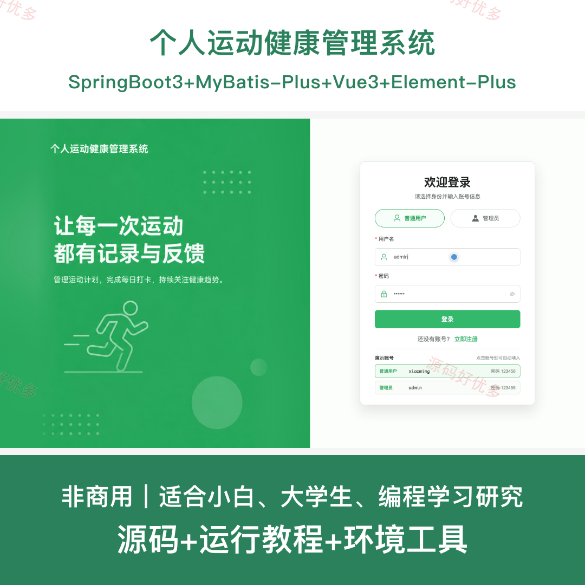
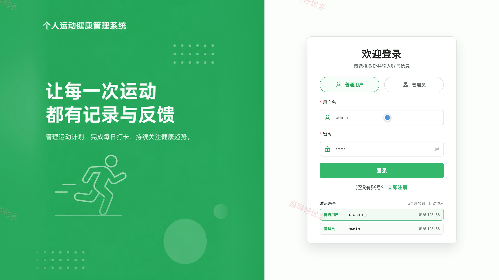
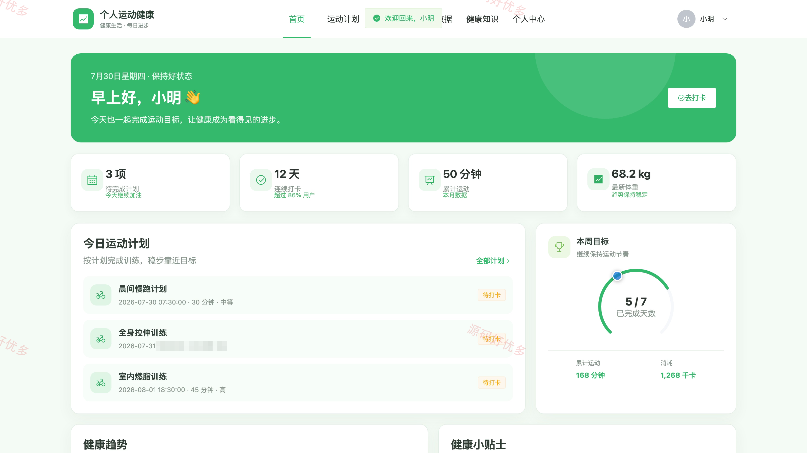
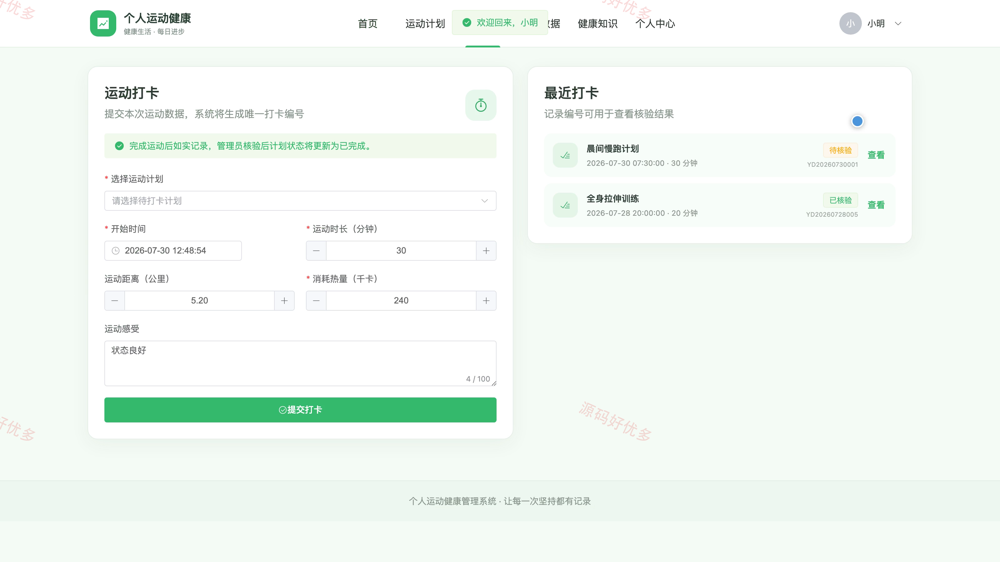
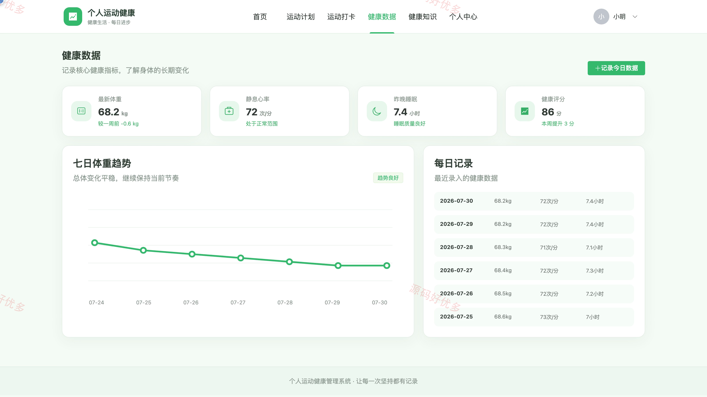
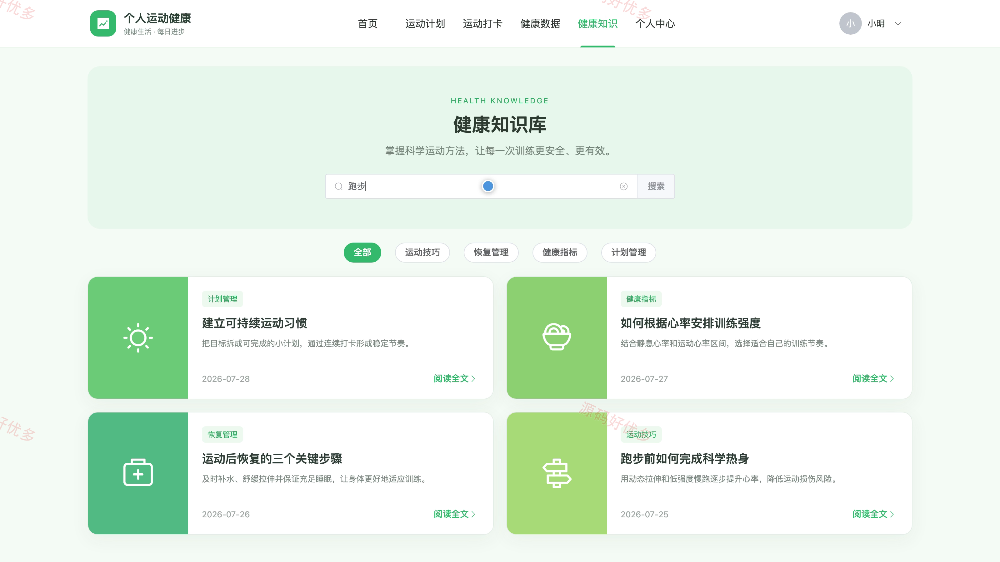
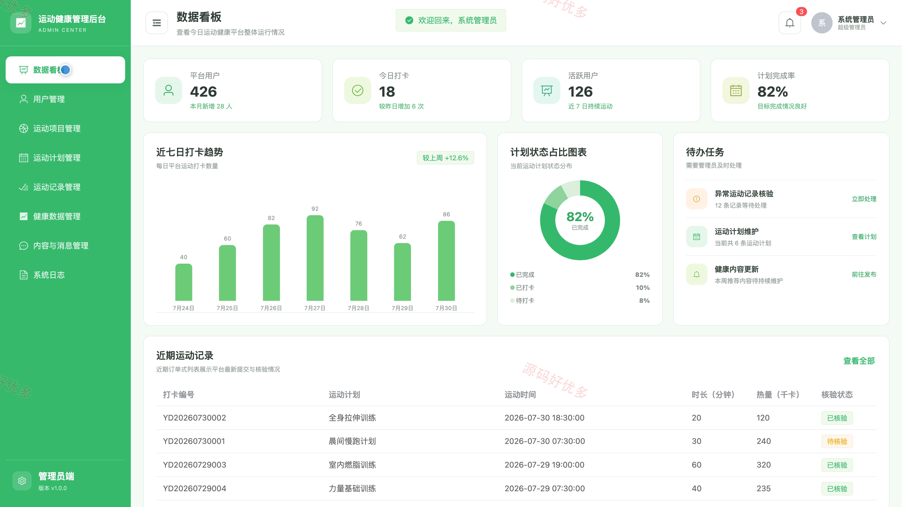
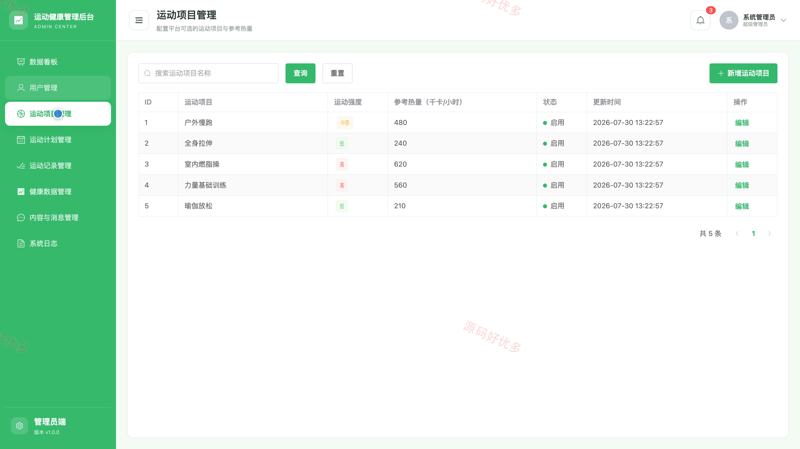
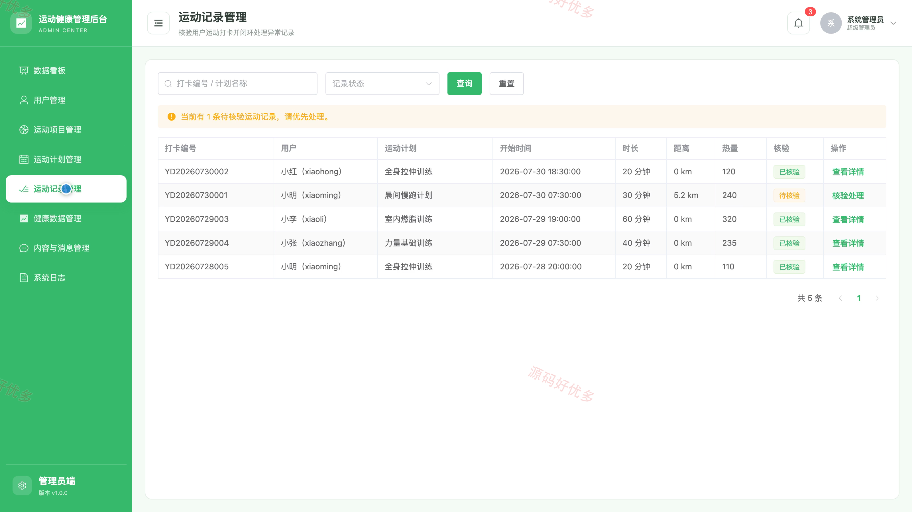

# bs011A
bs011A个人运动健康管理系统
## 源码问题查看主页咨询

### 一、关键词
个人运动健康、运动打卡、健身计划、体重管理、营养健康

### 二、作品包含
源码+数据库+全套环境和工具资源+本地部署教程

### 三、项目技术
前端技术： Html、Css、Js、Vue3.4、Element-Plus
后端技术：Java、SpringBoot3.2.0、MyBatis-Plus

### 四、运行环境（以下版本亲测，其他版本兼容性请自行测试）
开发工具：IDEA/eclipse + VSCODE

数据库：MySQL5.7+（共11张表）

数据库管理工具：Navicat10以上版本

环境配置软件： JDK17 + Maven3.6.3

前端Nodejs：16+

浏览器：谷歌浏览器

### 五、项目介绍
项目编号：bs011A

个人运动健康管理系统面向普通用户和管理员，围绕运动计划、运动打卡、健康指标记录、健康知识阅读与后台核验形成完整业务流程；普通用户可维护个人健康档案并记录运动健康数据，管理员统一维护用户、运动项目、计划、打卡记录、健康数据及内容消息。

角色：用户、管理员

用户功能：首页健康概览、运动计划查询、运动打卡、健康指标记录、健康趋势查看、健康知识浏览、个人健康档案维护、密码修改。

管理员功能：数据看板、用户管理、运动项目管理、运动计划管理、运动记录核验、健康数据管理、健康内容与消息管理、系统日志查看。

### 六、运行截图

